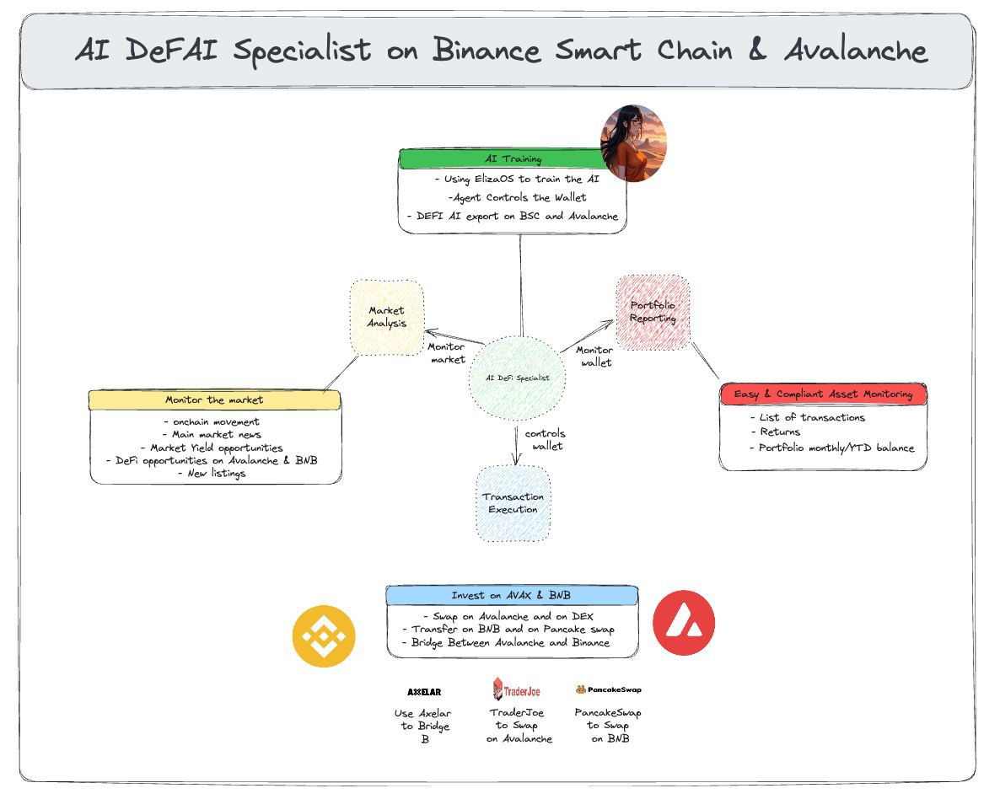

# EthOxford - Ideco Project (deFAI)

## Overview
**deFAI** is an AI-powered onchain investment assistant built on **AVAX** and **BNB**. It helps users automatically invest, monitor, and rebalance their portfolios via **Telegram**, using real-time blockchain data and alerts.

## Team Members
- **Jules**
- **Medhi**
- **Rayan**

## Tracks
This project integrates multiple blockchain ecosystems:
1. **Avalanche** - AI-driven automated transactions on AVAX.
2. **GatlingX** - Efficient transaction execution.
3. **BNB** - Investment and portfolio management on Binance Smart Chain (BSC).

## Goal
The project is designed to assist users like **Ben**, a 33-year-old Uber driver, in investing and monitoring his onchain assets on **BNB and AVAX**.

### Use Case
- Ben invests **$250 per week** via Telegram.
- He can rebalance his portfolio weekly.
- Receives **alerts on major market movements**.
- Funds are **distributed** across **BNB and AVAX** ecosystems.
- AI tracks **whale transactions** and **market trends** using real-time data.

## Implementation
The project consists of three core components:
1. **Data Analysis** – Identify optimal investment strategies and up-to-date opportunities.
2. **Execution** – Automate cross-chain transactions across AVAX and BNB.
3. **Reporting** – Provide performance insights and risk monitoring.

## Steps
1. **Data APIs** – Fetch wallet and transaction data from BNB and Avalanche.
2. **Cross-Chain Messaging** – Use **Axelar** for interoperability.
3. **Smart Contract Execution** – Deploy contracts for transactions on each chain.
4. **AI Training** – Implement machine learning to track price movements and whale activity.
5. **Telegram Bot Integration** – Enable users to interact and execute trades seamlessly.

## Resources

### Cross-Chain Messaging
- [Axelar Documentation](https://docs.axelar.dev/)

### AI Agent Integration
- [ElizaOS AI](https://www.elizaos.ai/)

### Blockchain APIs & Protocols
#### **BNB**
- [BSCScan API](https://docs.bscscan.com/)
- [PancakeSwap API](https://thegraph.com/explorer/subgraphs/A1fvJWQLBeUAggX2WQTMm3FKjXTekNXo77ZySun4YN2m?view=Query&chain=arbitrum-one)

#### **Avalanche**
- [Trader Joe](https://traderjoexyz.com/)
- [Avalanche RPC](https://api.avax.network/ext/bc/C/rpc)
- [GMX Token API](https://gmx-avax-server.uc.r.appspot.com/tokens)

#### **Market & Liquidity Data**
- [CoinGecko](https://www.coingecko.com/)
- Wallets: Top 100 addresses, ranking changes.
- Transaction volume & count.
- Gas fees & gas price.
- Liquidity Pool metrics & swap activity.
- PancakeSwap pool data:
  - Liquidity in USD (`reserveUSD`).
  - Trading volume (`volumeUSD`).

### Avacloud Portal
- [Avalanche Cloud Services](https://avacloud.io/)

## Telegram Bot Permissions
The bot requires the following permissions:
- **User Authentication**: Secure login using **Telegram OAuth**.
- **Transaction Execution**: The bot will prompt users for **manual approval** for each transaction.
- **Portfolio Access**: Users can link their wallets to **track performance and balances**.
- **Notifications**: Alerts on **market trends**, **price movements**, and **security risks**.
- **Whale Monitoring**: AI-based insights on significant wallet movements.

## Future Enhancements
- **More chains support** (Ethereum, Polygon, Arbitrum)
- **Advanced AI-based portfolio optimization**
- **Automated DeFi yield farming strategies**
- **Fiat on-ramp integration**

## Contributing
We welcome contributions! Please follow these steps:
1. Fork the repository.
2. Create a new branch (`feature-name`).
3. Submit a pull request.

For questions, reach out to **[Jules](https://github.com/julesfoa), [Medhi](https://github.com/Dimeh91), or [Rayan](https://github.com/rayan-elidrissi)!**.

### 🚀 Stay tuned for upcoming releases!
